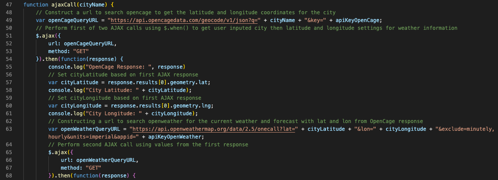
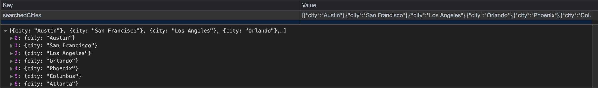
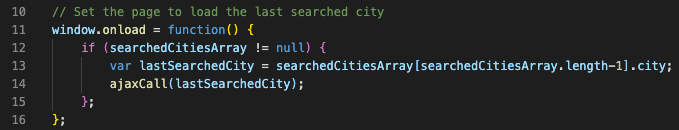
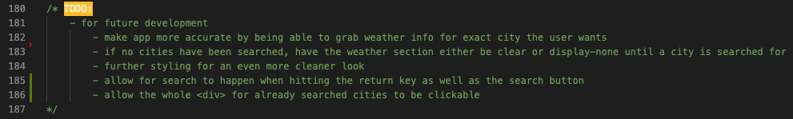
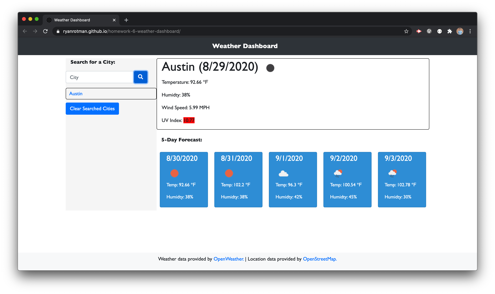
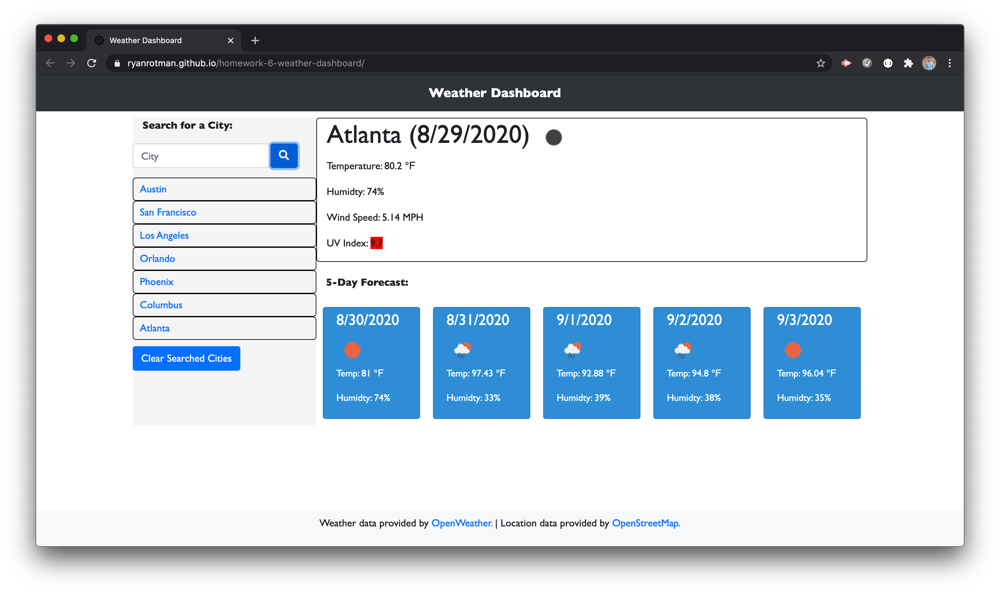

# Weather Dashboard

## Description
<!-- This repository holds the sixth homework assignment for [The Coding Boot Camp](https://techbootcamps.utexas.edu/coding/) through the University of Texas at Austin's Center for Professional Education. -->

This application is a weather dashboard where a user will search for a city and then be shown current weather data for the selected city as well as a 5-day forecast. The users search would be added to a list of previously searched cities and that data would persist if the browser is closed or refreshed. Along with data being saved in local storage, if the browser was closed, upon re-opening the user would be provided automatically with the data from the last searched city. What makes this application possible is the addition of using server-side third-party APIs. The calls were made using JavaScript's AJAX function and this page was developed using semantic HTML, additional CSS along with Bootstrap's styling, JavaScript, and JQuery.

## Notes
* AJAX calls were used along with building the query url through the use of variables for data, api keys, and even parsing data from a first AJAX call to a second.
    > 

* Saving searched cities in local storage using JSON.
    > 

* If there is saved data, the window would load with the weather data from the last searched for city.
    > 

* Processing and planning for further development to this project.
    > 

## Page Screenshots
Weather data returned from API call

Prior city searches added to list, persisting in local storage, and last searched city's weather data returned upon page load

## Credits
* [FontAwesome](https://fontawesome.com/license/free) - button icon
* [OpenWeather](https://openweathermap.org/) - weather data
* [OpenStreetMap](https://www.openstreetmap.org/) - location data

## Link
Github Pages Link: [ryanrotman.github.io/weather-dashboard/](https://ryanrotman.github.io/weather-dashboard/)